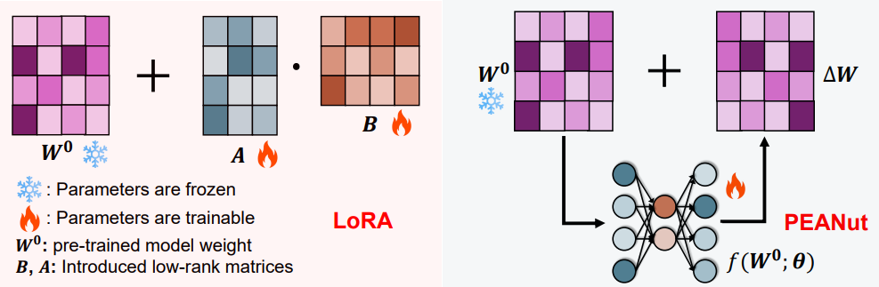

<h1>PEANuT 🥜</h1>
<h3>Parameter-Efficient Adaptation with Weight-aware Neural Tweakers</h3>

**TL;DR**: PEANuT is a novel PEFT framework that introduces weight-aware neural tweakers, compact neural modules that generate task-adaptive updates conditioned on frozen pre-trained weights, providing a flexible yet efficient way to capture complex update patterns without full model tuning.

**The experiment setups are located in each subfolder.**
